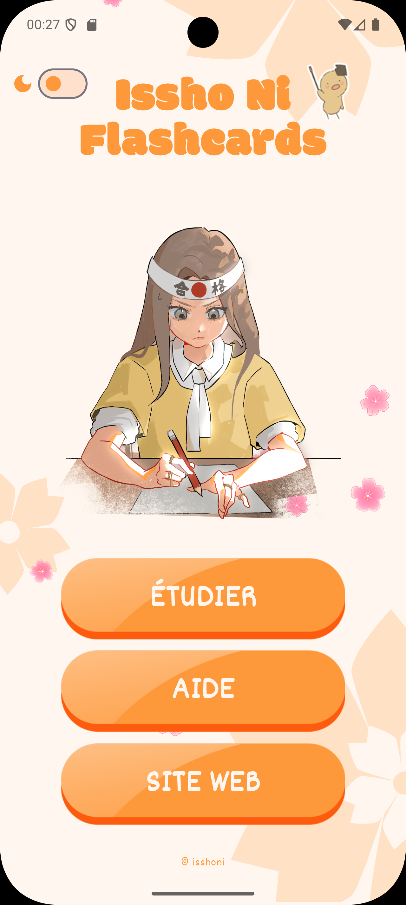
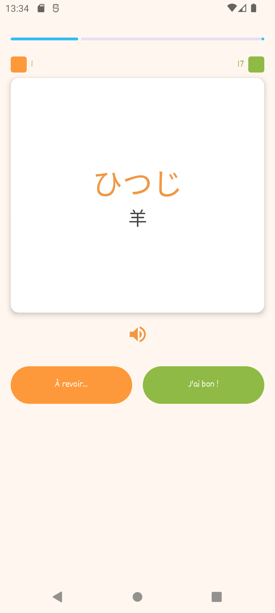
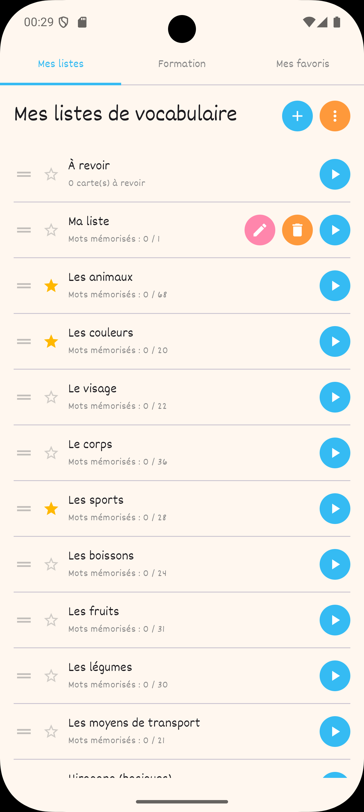
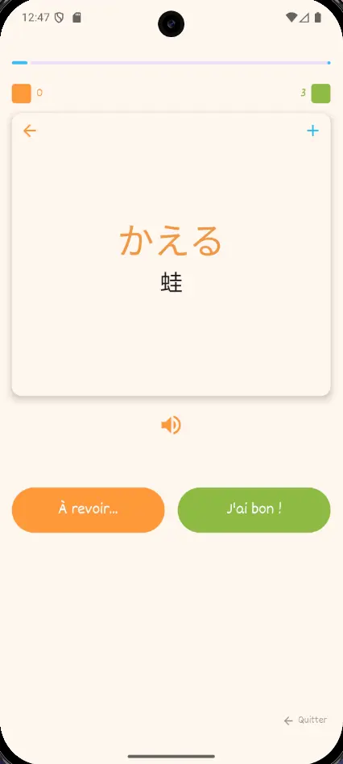

# Issho Ni Flashcards

Application d'apprentissage et de révision du japonais, conçue pour les élèves de la formation **Issho Ni**. Elle propose un système de flashcards bilingues (français ↔ japonais) et un mode d'écriture manuscrite de kanji et kana, avec suivi de progression, listes personnalisées et synchronisation entre appareils.

Une partie du contenu est librement accessible. L'accès aux modules de formation et à la synchronisation de progression nécessite d'être élève Issho Ni.

---

## Versions

### Android


[](https://play.google.com/store/apps/details?id=fr.isshoni.cards)

### iOS — Kotlin Multiplatform


*Publication App Store à venir*

---

## Aperçu

| Accueil | Session de cartes | Mes listes |
|---|---|---|
|  |  |  |

---

## ✨ Fonctionnalités

### Flashcards

#### Accessible sans compte
- **Listes par défaut** : vocabulaire (animaux, couleurs, visage, corps, sports, boissons, fruits, légumes, transports) + kana (hiragana, katakana, tous les kana) — plus de 500 cartes incluses
- **Listes personnalisées** : créer, renommer, supprimer, réordonner par glisser-déposer
- **Cartes personnalisées** : français, kana, kanji, phrase exemple et image
- **Sessions de révision** : choix du sens (FR→JP ou JP→FR), animation de retournement de carte
- **Piles verte/orange** : trier les cartes maîtrisées et celles à revoir pendant la session
- **Synthèse vocale** : écouter la prononciation japonaise
- **Favoris** : accès rapide aux listes favorites
- **Import / export** : sauvegarder et restaurer ses listes au format JSON

#### Réservé aux élèves (connexion requise)
- **Modules de formation** : accès aux listes N5 et N4 (selon les droits du compte)
- **Synchronisation de progression** : retrouver sa progression sur tous ses appareils

### Écriture de kanji et kana

#### Accessible sans compte
- **Listes d'entraînement** : Hiragana (46 caractères), Katakana (46 caractères) et Kanji basiques (103 kanji du N5)
- **Listes personnalisées de kanji** : créer ses propres listes depuis un dictionnaire intégré de milliers de kanji
- **Écriture manuscrite** : tracer les traits un par un sur un canvas, avec validation géométrique en temps réel
- **Dictionnaire KANJIDIC2** : recherche par kanji, lecture kana ou traduction française, avec lectures kun/on complètes
- **Système d'aide** : mini flashcard à retourner et indice visuel (trait suivant en pointillé)
- **Suivi de maîtrise** : un kanji est maîtrisé si tous les traits sont réussis sans aide
- **Favoris** : listes, modules et kanji individuels
- **Import / export** : sauvegarder et restaurer ses listes au format JSON

#### Réservé aux élèves (connexion requise)
- **Modules de formation** : accès aux listes N5 et N4 (selon les droits du compte) classées par modules
- **Synchronisation de progression** : retrouver sa progression sur tous ses appareils

---

## 🎴 Retournement de carte



---

## ✍️ Écriture de kanji


---

## 🌸 Animation sakura


---

## 🛠️ Stack technique

### Android

| Composant | Technologie |
|---|---|
| Langage | Kotlin 2.3.20 |
| UI | Jetpack Compose + Material3 |
| Navigation | Navigation Compose 2.9.7 |
| Base de données | Room 2.8.4 |
| Réseau | Retrofit 3.0.0 + OkHttp + Gson |
| Stockage sécurisé | EncryptedSharedPreferences (AndroidX Security Crypto) |
| Préférences | DataStore Preferences 1.1.4 |
| Chargement d'images | Coil 3.2.0 |
| Synthèse vocale | Google Cloud TTS (Chirp 3 HD & Neural2) + Android TTS natif (fallback) |
| Tracés kanji | KanjiVG (CC BY-SA 3.0) — données vectorielles SVG |
| Dictionnaire kanji | KANJIDIC2 (CC BY-SA 4.0, EDRDG) — lectures et traductions |
| Drag & drop | Reorderable 2.4.3 |
| Tests | JUnit 4, MockK, kotlinx-coroutines-test |
| Min SDK | 24 (Android 7.0) / Target SDK 36 |

### iOS — Kotlin Multiplatform

| Composant | Technologie |
|---|---|
| Langage | Kotlin 2.3.20 (K2) |
| UI | Compose Multiplatform 1.8.0 + Material3 |
| Navigation | Jetpack Navigation Compose 2.9.7 (multiplatform) |
| Base de données | SQLDelight 2.0.2 |
| Réseau | Ktor 3.1.3 + kotlinx.serialization 1.7.3 |
| Stockage sécurisé | Keychain Services |
| Préférences | multiplatform-settings 1.2.0 |
| Chargement d'images | Coil 3.2.0 (coil-network-ktor3) |
| Synthèse vocale | Google Cloud TTS (Chirp 3 HD & Neural2) + AVAudioPlayer · Fallback natif AVSpeechSynthesizer |
| Tracés kanji | KanjiVG (CC BY-SA 3.0) — données vectorielles SVG |
| Dictionnaire kanji | KANJIDIC2 (CC BY-SA 4.0, EDRDG) — lectures et traductions |
| Drag & drop | Reorderable 2.4.3 |
| Logging | Napier 2.7.1 |
| ViewModel | AndroidX Lifecycle 2.10.0 (multiplatform) |
| Tests | JUnit 4, kotlinx-coroutines-test, Turbine, MockK |
| Targets | `iosX64`, `iosArm64`, `iosSimulatorArm64` |
| iOS minimum | 17.2 |

---

## 📁 Structure du projet

### Android

```
app/src/main/java/com/isshoni/flashcards/
│
├── data/
│   ├── kanji/          # Modèles kanji (StrokeData, StrokeMatcher, KanjiReading)
│   ├── local/          # Entités Room, DAOs, Database
│   ├── remote/         # API Retrofit, DTOs
│   └── repository/     # Source unique de vérité, gestion offline/online
│
├── ui/
│   ├── components/
│   ├── kanji/          # Écrans et composants du mode écriture
│   ├── navigation/
│   ├── screens/
│   ├── theme/
│   ├── tts/
│   └── viewmodels/
│
└── assets/
    └── fonts/licences/
```

### iOS — Kotlin Multiplatform

```
composeApp/src/commonMain/
│
├── data/
│   ├── kanji/          # Modèles kanji (StrokeData, StrokeMatcher, KanjiReading)
│   ├── local/          # SQLDelight (schémas .sq, SecureStorage, FileOps)
│   ├── remote/         # Ktor (NetworkModule, modèles API)
│   └── repository/     # Logique métier, sync serveur, import/export
│
├── ui/
│   ├── components/     # Composants réutilisables (dialogs, boutons, animations)
│   ├── navigation/     # Routes typées
│   ├── screens/        # Écrans (home, flashcards, formation, login…)
│   ├── theme/          # Couleurs, typographies, Material3
│   ├── tts/            # Synthèse vocale + lecture audio (expect)
│   └── viewmodels/     # HomeViewModel, FlashcardViewModel, SearchViewModel
│
└── composeResources/   # Drawables, fonts (Dekko, Modak, Naikai)

composeApp/src/iosMain/     # actual iOS : Keychain, Darwin, AVFoundation
composeApp/src/androidMain/ # actual Android : dev uniquement, non publié

iosApp/                     # Wrapper Xcode (Swift minimal)
```

---

## 💡 Défis techniques notables

- Migration Android → Kotlin Multiplatform : Room → SQLDelight, Retrofit → Ktor, `expect/actual` pour TTS, Keychain, drivers SQLite
- Synchronisation de progression offline/online avec gestion des conflits
- Persistance de progression entre sessions imbriquées, analyse fine du cycle de vie du ViewModel
- Validation géométrique des tracés manuscrits : comparaison trait par trait (forme, position, direction, longueur) avec les données vectorielles KanjiVG
- Composition IME japonaise et recherche réactive multilingue
- Chiffrement des tokens d'authentification (EncryptedSharedPreferences / Keychain)
- Animation Canvas personnalisée (pétales de sakura)
- Drag & drop sur listes avec persistance de l'ordre
- CI/CD GitHub Actions : compilation Kotlin/Native cross-platform depuis Linux, build iOS sur runner macOS

---

## 🔒 Politique de confidentialité

L'application collecte des données personnelles uniquement dans le cadre de la connexion au compte Issho Ni (identifiants, progression pédagogique). Ces données ne sont jamais revendues à des tiers.

[Consulter la politique complète](https://www.isshoni.fr/politique-de-confidentialite/)

---

## 📄 Licence

Ce logiciel est distribué sous licence propriétaire. Tous droits réservés — © Stéphane FRERET.

Toute reproduction, modification ou redistribution est interdite sans autorisation écrite explicite.

Les polices utilisées (Dekko, Modak, Noto Sans JP) sont distribuées sous [licence OFL](https://openfontlicense.org).
Les données de tracés sont issues de [KanjiVG](https://kanjivg.tagaini.net/) (CC BY-SA 3.0).
Le dictionnaire de kanji est basé sur [KANJIDIC2](http://www.edrdg.org/wiki/index.php/KANJIDIC_Project) (CC BY-SA 4.0, EDRDG).
